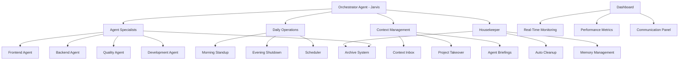

# Jarvis Super Agent System

> **Advanced Multi-Agent AI Orchestration Platform**  
> Automated project management, seamless agent coordination, and intelligent workflow orchestration for enterprise-grade AI development.

[](https://opensource.org/licenses/MIT)
[](https://www.python.org/downloads/)
[](https://nodejs.org/)
[](https://www.typescriptlang.org/)

## 🎯 Overview

The Jarvis Super Agent System is a comprehensive multi-agent AI orchestration platform designed for enterprise-scale development projects. It provides automated project initialization, intelligent agent coordination, seamless workflow management, and perfect continuity between work sessions.

### Key Features

- **🚀 @Jarvis Trigger System** - Instant multi-agent activation with `@Jarvis` command
- **🤖 11-Agent Orchestration** - Complete specialized team (orchestrator, development, quality, research, communication, support, architect, housekeeper, debugger, optimizer, innovation)
- **🧠 Auto-Acceptance System** - Intelligent automation with confidence-based decision making
- **🏠 Smart Housekeeper** - Automated file organization and cleanup (21GB→500MB optimization)
- **📊 Real-Time Dashboard** - React-based monitoring at localhost:3010 with live agent status
- **🔄 Perfect Context Persistence** - Zero-loss memory with ML optimization
- **🛡️ Enterprise Security** - Credential management, audit trails, and safety monitoring
- **⚡ 5-Minute Setup** - From clone to running AI agents with automatic initialization
- **📈 ML Optimization** - 6-hour learning cycles with performance tracking
- **🎯 Interactive Onboarding** - Built-in wizard with agent-specific guidance
- **🌅 Scheduled Operations** - Daily standups, evening shutdowns, and maintenance cycles
- **📁 Professional Deployment** - GitHub-optimized with comprehensive documentation

## 🏗️ System Architecture



## 🚀 Quick Start - Get Running in 60 Seconds!

### @Jarvis Instant Setup

```bash
# Clone and initialize
git clone https://github.com/VeloF2025/Super_Agent.git
cd Super_Agent

# Activate full 11-agent system
python shared/tools/multi_agent_initializer.py

# Start real-time dashboard
cd agent-dashboard && npm install && npm start
# Dashboard opens at http://localhost:3010
```

**System Requirements:**
- Python 3.8+ (agent orchestration)  
- Node.js 18+ (React dashboard)
- 4GB+ RAM (11-agent coordination)
- 500MB storage (deployment) / 21GB+ (development)

That's it! The setup wizard will:
- ✅ Check all prerequisites automatically
- ✅ Install missing components
- ✅ Create your configuration
- ✅ Set up your first project
- ✅ Start all services
- ✅ Open the dashboard in your browser

### What You Get

After setup completes, you'll have:
- 🤖 **11 AI Agents** active and coordinated (orchestrator, development, quality, research, communication, support, architect, housekeeper, debugger, optimizer, innovation)
- 🎨 **Real-Time Dashboard** at http://localhost:3010 with live agent monitoring
- 🧠 **Auto-Acceptance System** with intelligent decision making
- 🏠 **Smart Housekeeper** maintaining optimal file organization
- 📊 **ML Optimization** with 6-hour learning cycles
- 🔄 **Perfect Context Persistence** with zero-loss memory

### Manual Setup (Advanced Users)

If you prefer manual setup:

1. **Clone the repository:**
   ```bash
   git clone https://github.com/VeloF2025/Super_Agent.git
   cd Super_Agent
   ```

2. **Initialize Super Agent System:**
   ```bash
   # Automatic @Jarvis activation
   python shared/tools/multi_agent_initializer.py
   ```

3. **Start the dashboard:**
   ```bash
   cd agent-dashboard
   npm install && npm start
   # Opens at http://localhost:3010
   ```

4. **Verify system status:**
   ```bash
   # Check all 11 agents are active
   ls shared/heartbeats/*.heartbeat
   ```

## 📋 Core Components

### 🤖 Agent Specialists

| Agent | Purpose | Capabilities |
|-------|---------|--------------|
| **Orchestrator (Jarvis)** | System coordination and management | Multi-agent coordination, auto-acceptance, workflow orchestration, priority management |
| **Development Agent** | Code implementation and technical tasks | Python, JavaScript, TypeScript, debugging, refactoring, code analysis |
| **Quality Agent** | Testing and validation | Unit tests, integration tests, code quality, security audits, CI/CD |
| **Research Agent** | Investigation and analysis | Technology research, best practices, competitive analysis, documentation |
| **Communication Agent** | Inter-agent messaging and coordination | Message routing, protocol management, event handling, status updates |
| **Support Agent** | User assistance and help desk | Troubleshooting, guidance, onboarding, issue resolution |
| **Architect Agent** | System design and architecture | Technical architecture, design patterns, scalability, integration planning |
| **Housekeeper Agent** | File organization and maintenance | Automated cleanup, file organization, space optimization, directory management |
| **Debugger Agent** | Error detection and troubleshooting | Bug identification, root cause analysis, performance debugging, system diagnostics |
| **Optimizer Agent** | Performance tuning and efficiency | Resource optimization, speed improvements, cost reduction, automation |
| **Innovation Agent** | Breakthrough solutions and R&D | New technologies, experimental features, process improvements, AI advancement |

### 🌅 Daily Operations

- **Morning Standup (9:00 AM)**
  - Load yesterday's progress
  - Check system health
  - Assign today's priorities
  - Initialize agent contexts

- **Evening Shutdown (6:00 PM)**
  - Collect accomplishments
  - Archive daily data
  - Plan tomorrow's work
  - Generate reports

- **Midday Check (1:00 PM)**
  - Status monitoring
  - Issue identification
  - Performance check

### 📊 Real-Time Dashboard

- **Agent Status Monitoring** - Live activity tracking
- **Communication Visualization** - Message flow between agents
- **Project Management** - Active workflows and progress
- **Performance Analytics** - Metrics and historical data
- **System Health** - Resource usage and diagnostics

### 🧹 Automated Housekeeper

- **File Organization** - Automatic cleanup and archiving
- **Memory Management** - Intelligent data retention
- **Performance Optimization** - Resource monitoring
- **Security Maintenance** - Credential and log management

## 🎯 Context Engineering & Project Creation

### Quick Project Creation (NEW!)

Use our project template system for instant setup:

```bash
# Interactive project creation
python project_templates.py create

# Or specify type directly
python project_templates.py create --type web_app
```

Available templates:
- **web_app** - Full-stack web application with React/Vue + Express/FastAPI
- **api** - REST API with authentication and documentation
- **data_analysis** - Data pipeline with ML capabilities
- **automation** - Workflow automation and scheduling

### Traditional Project Initialization

1. **Drop requirements** into `context-inbox/new-projects/`
2. **Automatic processing** extracts project information
3. **Agent briefings** generated with specific contexts
4. **Intelligent allocation** based on project complexity

### Existing Project Takeover

1. **Place takeover request** in `context-inbox/existing-projects/`
2. **Codebase analysis** identifies architecture and patterns
3. **Context generation** preserves existing knowledge
4. **Seamless handoff** with full understanding

## 📁 Directory Structure

```
Super Agent/
├── agents/                    # Specialized agent workspaces
│   ├── agent-frontend/        # Frontend development agent
│   ├── agent-backend/         # Backend development agent
│   ├── agent-quality/         # Quality assurance agent
│   └── ...
├── agent-dashboard/           # Real-time monitoring dashboard
├── context-inbox/             # Project initialization system
│   ├── new-projects/          # New project requirements
│   ├── existing-projects/     # Project takeover requests
│   └── processed/             # Completed contexts
├── daily-ops/                 # Automated daily routines
│   ├── morning-standup.py     # Morning coordination
│   ├── evening-shutdown.py    # Evening preservation
│   └── jarvis-scheduler.py    # Automated scheduling
├── housekeeper/               # Automated maintenance
├── communication/             # Inter-agent messaging
├── memory/                    # Persistent data storage
├── workflows/                 # Active project workflows
└── logs/                      # System and agent logs
```

## 🔧 Configuration

### Scheduler Configuration

```json
{
  "morning_standup_time": "09:00",
  "evening_shutdown_time": "18:00",
  "midday_check_time": "13:00",
  "weekend_mode": false,
  "auto_housekeeper": true,
  "notifications_enabled": true
}
```

### Housekeeper Rules

```json
{
  "retention_days": 7,
  "auto_cleanup_interval_hours": 6,
  "cleanup_targets": [
    {
      "path": "context-inbox/processed",
      "retention_days": 7,
      "archive_to": "context-inbox/archive"
    }
  ]
}
```

## 🧠 ML Optimization & Learning

The system continuously learns and improves through:

### Performance Tracking
- **Agent Scoring** - Real-time performance metrics with ML analysis
- **Evolution Tracking** - Monitor how agents improve over time
- **Pattern Recognition** - Identify successful strategies automatically

### Collaborative Learning
- **Team Discovery** - Find optimal agent combinations
- **Knowledge Transfer** - Share insights between agents
- **Success Patterns** - Learn from completed tasks

### Access ML Insights
- Open dashboard and click "ML Optimization" tab
- View agent rankings and performance trends
- See collaboration network visualization
- Track improvement over time

### API Endpoints
```bash
# Check ML optimization status
curl http://localhost:8000/api/jarvis/ml-optimization/status

# Get agent performance scores
curl http://localhost:8000/api/jarvis/ml-optimization/agent-performance

# Trigger learning cycle
curl -X POST http://localhost:8000/api/jarvis/ml-optimization/trigger-learning-cycle
```

## 📊 Performance Metrics

- **Agent Efficiency** - ML-tracked tasks completed per hour
- **Collaboration Score** - Inter-agent teamwork quality
- **Learning Rate** - Improvement velocity over time
- **Success Patterns** - Identified winning strategies
- **System Health** - Auto-monitored with health checks

## 🛡️ Security Features

- **Secure Communication** - Encrypted inter-agent messaging
- **Credential Management** - Automated key rotation and storage
- **Audit Trails** - Comprehensive activity logging
- **Access Control** - Role-based permissions
- **Data Protection** - Automatic backup and recovery

## 🔗 Integration

### Git Workflow Integration

- **Automatic commits** with meaningful messages
- **Branch coordination** across agent workspaces
- **Pre-deployment checks** and documentation updates
- **Conflict resolution** and merge coordination

### CI/CD Pipeline

- **Automated testing** before deployment
- **Documentation generation** from code and comments
- **Performance benchmarking** and regression detection
- **Security scanning** and vulnerability assessment

## 📈 Monitoring & Analytics

### Real-Time Metrics

- Agent activity and performance
- System resource utilization
- Communication patterns
- Error rates and resolution times

### Historical Analysis

- Project completion trends
- Agent efficiency over time
- Resource usage patterns
- Cost optimization opportunities

## 🚨 Troubleshooting & Health

### Automatic Health Checks

The system includes self-healing capabilities:

```bash
# Run health check with auto-fix
python health_check.py

# Check without fixing
python health_check.py --no-fix

# Generate detailed report
python health_check.py --report
```

### Common Issues

| Issue | Solution |
|-------|----------|
| **Setup fails** | Run `python health_check.py` to auto-fix |
| **Agents offline** | Check logs in `logs/` directory |
| **Port conflicts** | Change ports in `.env` file |
| **Missing API keys** | Add to `.env` or skip during setup |

### Integration Testing

Verify your system is working correctly:

```bash
# Run full integration test suite
python test_integration.py
```

## 🤝 Contributing

1. **Fork the repository**
2. **Create a feature branch** (`git checkout -b feature/amazing-feature`)
3. **Commit your changes** (`git commit -m 'Add amazing feature'`)
4. **Push to the branch** (`git push origin feature/amazing-feature`)
5. **Open a Pull Request**

### Development Guidelines

- Follow existing code style and patterns
- Add tests for new functionality
- Update documentation for changes
- Ensure all agents pass health checks
- Run `python test_integration.py` before submitting

## 📜 License

This project is licensed under the MIT License - see the [LICENSE](LICENSE) file for details.

## 🆘 Support

- **Quick Start Guide**: See [README_QUICKSTART.md](README_QUICKSTART.md)
- **Full User Guide**: See [COMPLETE_USER_GUIDE.md](COMPLETE_USER_GUIDE.md)
- **Documentation**: [Full documentation](docs/)
- **Deployment**: [Preparation Guide](DEPLOYMENT_PREPARATION.md) 
- **Contributing**: [Development Guide](CONTRIBUTING.md)
- **Issues**: [GitHub Issues](https://github.com/VeloF2025/Super_Agent/issues)
- **Discussions**: [GitHub Discussions](https://github.com/VeloF2025/Super_Agent/discussions)
- **Discord**: Join our community for real-time help

## 🙏 Acknowledgments

- Built with modern AI orchestration principles
- Inspired by enterprise software development practices
- Designed for scalability and maintainability
- Community-driven development and feedback

---

*Last updated: 2025-07-21 08:19:43 by Jarvis Doc Generator*

