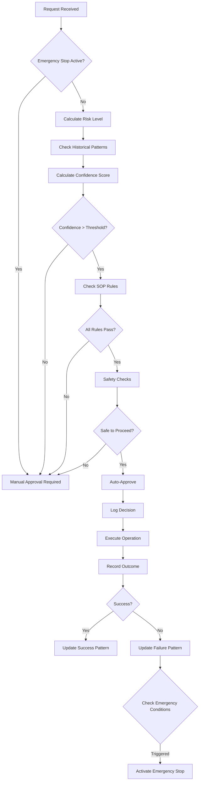

# Standard Operating Procedure: Jarvis Auto-Acceptance System

## Overview

The Jarvis Auto-Acceptance System enables intelligent automation of routine operations based on learned patterns, confidence scoring, and comprehensive safety mechanisms. This SOP defines the policies, procedures, and safety protocols for autonomous decision-making.

## System Components

### 1. Auto-Acceptance Engine (`jarvis_auto_acceptance.py`)
- Evaluates requests based on historical patterns
- Calculates confidence scores
- Makes auto-approval decisions
- Tracks success/failure rates

### 2. Decision Logger (`jarvis_decision_logger.py`)
- Records all decisions with full audit trail
- Tracks decision chains and dependencies
- Enables rollback capabilities
- Generates compliance reports

### 3. Safety Monitor (`jarvis_safety_monitor.py`)
- Real-time system health monitoring
- Emergency stop capabilities
- Resource usage tracking
- Cascade failure detection

## Operation Types and Risk Levels

### Minimal Risk (Auto-approve at 50% confidence)
- `FILE_READ` - Reading files and logs
- `LOG_ANALYSIS` - Analyzing log data
- `HEALTH_CHECK` - System health checks
- `MONITORING_CHECK` - Performance monitoring

### Low Risk (Auto-approve at 60% confidence)
- `CODE_ANALYSIS` - Static code analysis
- `REPORT_GENERATION` - Creating reports
- `CONTEXT_SAVE` - Saving context data
- `AGENT_COMMUNICATION` - Inter-agent messages
- `CACHE_CLEAR` - Clearing temporary data

### Medium Risk (Auto-approve at 70% confidence)
- `FILE_WRITE` - Writing to files
- `CONFIG_UPDATE` - Configuration changes
- `BACKUP_CREATE` - Creating backups
- `DATA_PROCESSING` - Processing user data

### High Risk (Auto-approve at 90% confidence)
- `SERVICE_START` - Starting services
- `SERVICE_STOP` - Stopping services
- `DEPENDENCY_INSTALL` - Installing packages

### Critical Risk (Requires manual approval)
- `FILE_DELETE` - Deleting files
- `SYSTEM_MODIFICATION` - Core system changes
- `SECURITY_CHANGES` - Security configurations

## Auto-Acceptance Decision Flow



## Confidence Building Process

### Initial State
- New operation types start with 30% confidence
- Require 5 successful operations to reach baseline

### Confidence Calculation
```
confidence = (success_rate * 0.7) + (volume_factor * 0.3)
where:
- success_rate = successes / total_operations
- volume_factor = min(1.0, total_operations / 100)
```

### Confidence Decay
- Patterns older than 30 days receive 20% confidence reduction
- Ensures system adapts to changing conditions

## Safety Mechanisms

### 1. Real-time Monitoring
- Heartbeat checks every 30 seconds
- Resource usage monitoring
- Error rate tracking
- Performance metrics

### 2. Emergency Stop Triggers
- Critical threat level detected
- Multiple critical issues (≥2)
- Multiple danger conditions (≥3)
- Failure rate >30% in last hour
- 5+ failures in last hour

### 3. Blocked Operations During Emergency
- Auto-acceptance
- Task assignment
- Resource allocation
- System modifications

### 4. Recovery Procedures
1. Admin authentication required
2. System health check
3. Clear emergency state
4. Resume monitoring
5. Gradual re-enablement

## Decision Logging Requirements

### Every Decision Must Record:
- Unique decision ID
- Timestamp
- Agent making decision
- Decision type and description
- Context and alternatives considered
- Reasoning for choice
- Expected impact
- Reversibility status
- Rollback plan (if applicable)

### Post-Execution Recording:
- Actual outcome
- Performance metrics
- Error details (if failed)
- Rollback status

## Operational Procedures

### 1. Enabling Auto-Acceptance
```python
# Initialize systems
auto_accept = JarvisAutoAcceptance()
decision_logger = JarvisDecisionLogger()
safety_monitor = JarvisSafetyMonitor()

# Check safety before enabling
threat_level, issues = safety_monitor.check_system_safety()
if threat_level.value <= ThreatLevel.CAUTION.value:
    # Safe to enable
    auto_accept.learning_enabled = True
```

### 2. Processing Requests
```python
# Evaluate request
approved, decision = auto_accept.evaluate_request(
    request_type=RequestType.FILE_READ,
    request_details={
        "file_path": "/logs/app.log",
        "purpose": "error_analysis"
    }
)

if approved:
    # Execute operation
    result = perform_operation()
    
    # Record outcome
    auto_accept.record_outcome(
        decision.decision_id,
        DecisionOutcome.SUCCESS if result else DecisionOutcome.FAILURE
    )
```

### 3. Emergency Response
```python
# If emergency triggered
if safety_monitor.emergency_stop_active:
    # 1. Alert administrators
    send_alert("Emergency stop activated")
    
    # 2. Generate incident report
    report = safety_monitor.get_safety_report()
    
    # 3. Wait for manual intervention
    # 4. Resume when authorized
    safety_monitor.resume_operations(admin_token)
```

## Compliance and Auditing

### Regular Reviews
- Daily: Review auto-acceptance rates and failures
- Weekly: Analyze patterns and adjust thresholds
- Monthly: Full audit trail review
- Quarterly: SOP effectiveness assessment

### Audit Trail Exports
```python
# Export for compliance
audit_file = decision_logger.export_audit_trail(
    start_date="2025-01-01",
    end_date="2025-01-31"
)
```

### Key Metrics to Monitor
1. **Acceptance Rate**: Target 60-80% for routine operations
2. **Success Rate**: Maintain >95% for auto-approved operations
3. **Emergency Stops**: Investigate any occurrence
4. **Response Times**: Monitor for degradation
5. **Resource Usage**: Stay within safety thresholds

## Best Practices

### 1. Conservative Thresholds
- Start with high confidence requirements
- Lower gradually based on success rates
- Never compromise safety for automation

### 2. Pattern Management
- Regularly review learned patterns
- Remove obsolete patterns
- Update for system changes

### 3. Testing New Operations
- Always test in safe environment first
- Start with manual approval
- Graduate to auto-approval after validation

### 4. Incident Response
- Document all incidents thoroughly
- Perform root cause analysis
- Update safety rules based on findings
- Share learnings across team

## Configuration Examples

### Setting Custom Rules
```python
# Add rule for specific operation
conn = sqlite3.connect(auto_accept.db_path)
cursor = conn.cursor()

cursor.execute("""
    INSERT INTO sop_rules 
    (rule_id, request_type, conditions, required_confidence, 
     max_risk_level, requires_verification, enabled)
    VALUES (?, ?, ?, ?, ?, ?, ?)
""", (
    "custom_backup_rule",
    RequestType.BACKUP_CREATE.value,
    json.dumps({"backup_type": "incremental"}),
    0.6,  # 60% confidence required
    RiskLevel.LOW.value,
    False,  # No manual verification
    True  # Enabled
))
conn.commit()
```

### Adjusting Safety Thresholds
```python
safety_monitor.safety_thresholds.update({
    "max_error_rate": 0.25,  # More tolerant
    "heartbeat_timeout": 180,  # 3 minutes
    "cascade_threshold": 4  # 4 failures before cascade
})
```

## Continuous Improvement

### Monthly Analysis Should Include:
1. Pattern effectiveness review
2. False positive/negative analysis  
3. Performance optimization opportunities
4. Safety threshold adjustments
5. New operation type candidates

### Feedback Loop
1. Collect agent feedback
2. Analyze decision outcomes
3. Update confidence algorithms
4. Refine safety rules
5. Enhance pattern recognition

## Security Considerations

### Access Control
- Admin tokens for emergency operations
- Read-only access for monitoring
- Audit trail immutability
- Encrypted storage for sensitive decisions

### Threat Mitigation
- Rate limiting on auto-approvals
- Anomaly detection for unusual patterns
- Isolation of critical operations
- Regular security audits

---

*This SOP is a living document and should be updated based on operational experience and system evolution.*

*Last Updated: 2025-07-21*
*Version: 1.0*