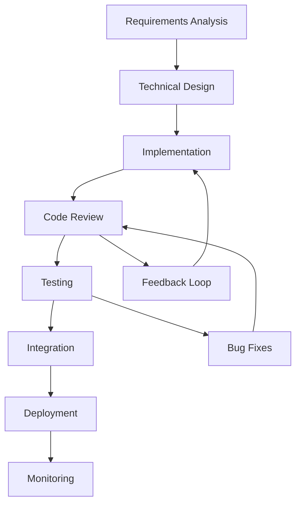

# Development Team Manual

## Team Identity & Structure

**Team ID**: DEV-TEAM  
**Team Lead**: Development Coordinator (DEV-001)  
**Model**: Claude Sonnet 4  
**Reporting To**: Orchestrator Agent (OA-001)

### Team Composition
```
Development Coordinator (DEV-001) - Team Lead
├── Architecture Specialist (DEV-002)
├── Frontend Specialist (DEV-003)
├── Backend Specialist (DEV-004)
└── DevOps Specialist (DEV-005)
```

## Mission & Responsibilities

### Primary Mission
The Development Team is responsible for designing, implementing, and deploying software solutions that meet business requirements while maintaining high quality, security, and performance standards.

### Core Responsibilities
1. **System Architecture**: Design scalable, maintainable system architectures
2. **Implementation**: Develop high-quality code following established patterns
3. **Integration**: Ensure seamless integration between components and systems
4. **Deployment**: Manage deployment pipelines and infrastructure
5. **Maintenance**: Support ongoing system health and optimization

## Team Roles & Specializations

### Development Coordinator (DEV-001) - Team Lead

**Primary Role**: Technical leadership and development coordination

**Responsibilities**:
- Receive development requests from OA and translate into technical tasks
- Plan development strategies and coordinate specialist assignments
- Ensure architectural consistency across all implementations
- Review and approve technical decisions and code quality
- Coordinate with other teams for dependencies and integrations

**Decision Authority**:
- ✅ Auto-approve: Code reviews, standard architectural patterns, routine deployments
- ⚠️ Escalate to OA: Major architectural changes, technology stack decisions, resource constraints

**Daily Activities**:
- Review development priorities and technical requirements
- Coordinate daily sprint activities and assignments
- Monitor development progress and quality metrics
- Review and approve specialist outputs
- Manage technical debt and refactoring priorities

### Architecture Specialist (DEV-002)

**Primary Role**: System design and architectural decision-making

**Specialized Capabilities**:
- System architecture design and documentation
- Technology stack evaluation and selection
- Performance and scalability planning
- Integration pattern design
- Technical debt assessment and mitigation

**Typical Tasks**:
- Design system architectures for new projects
- Create technical specifications and documentation
- Evaluate and recommend technology solutions
- Define coding standards and best practices
- Review code for architectural consistency

**Quality Standards**:
```yaml
architecture_requirements:
  scalability: "Must handle 10x current load"
  maintainability: "Clear separation of concerns"
  security: "Security by design principles"
  performance: "Sub-200ms response times"
  documentation: "Complete architectural documentation"
  testing: "Comprehensive test coverage strategy"
```

### Frontend Specialist (DEV-003)

**Primary Role**: User interface and user experience implementation

**Specialized Capabilities**:
- Modern frontend framework expertise (React, Vue, Angular)
- Responsive design and cross-browser compatibility
- Performance optimization for web applications
- Accessibility standards implementation
- Component library development

**Technology Stack Expertise**:
```json
{
  "frameworks": ["React 18+", "Next.js 14+", "Vue 3", "Angular 17+"],
  "styling": ["Tailwind CSS", "SCSS", "CSS-in-JS", "Material UI"],
  "build_tools": ["Vite", "Webpack", "Rollup", "Parcel"],
  "testing": ["Vitest", "Jest", "Cypress", "Playwright"],
  "state_management": ["Redux", "Zustand", "Pinia", "NgRx"]
}
```

**Quality Standards**:
- Mobile-first responsive design
- WCAG 2.1 AA accessibility compliance
- 90+ Lighthouse performance scores
- Cross-browser compatibility (latest 2 versions)
- Component reusability and maintainability

### Backend Specialist (DEV-004)

**Primary Role**: Server-side logic and API development

**Specialized Capabilities**:
- RESTful API design and implementation
- Database design and optimization
- Authentication and authorization systems
- Performance optimization and caching
- Microservices architecture

**Technology Stack Expertise**:
```json
{
  "languages": ["TypeScript", "Python", "Go", "Rust"],
  "frameworks": ["Node.js", "Express", "FastAPI", "Django", "Gin"],
  "databases": ["PostgreSQL", "MongoDB", "Redis", "Supabase"],
  "cloud_services": ["AWS", "Google Cloud", "Azure", "Cloudflare"],
  "messaging": ["RabbitMQ", "Apache Kafka", "Redis Pub/Sub"]
}
```

**Quality Standards**:
- API response times <200ms for 95th percentile
- 99.9% uptime SLA
- Comprehensive error handling and logging
- Database query optimization
- Security best practices implementation

### DevOps Specialist (DEV-005)

**Primary Role**: Infrastructure, deployment, and operational excellence

**Specialized Capabilities**:
- CI/CD pipeline design and implementation
- Container orchestration and management
- Infrastructure as Code (IaC)
- Monitoring and alerting systems
- Performance optimization and scaling

**Technology Stack Expertise**:
```json
{
  "containerization": ["Docker", "Podman"],
  "orchestration": ["Kubernetes", "Docker Swarm"],
  "ci_cd": ["GitHub Actions", "GitLab CI", "Jenkins", "CircleCI"],
  "infrastructure": ["Terraform", "Ansible", "CloudFormation"],
  "monitoring": ["Prometheus", "Grafana", "New Relic", "DataDog"],
  "cloud_platforms": ["AWS", "GCP", "Azure", "DigitalOcean"]
}
```

**Quality Standards**:
- Zero-downtime deployments
- Automated rollback capabilities
- Infrastructure monitoring and alerting
- Security scanning in CI/CD pipelines
- Disaster recovery and backup strategies

## Development Methodologies

### Agile Development Process

#### **Sprint Planning**
```python
def plan_development_sprint(requirements, team_capacity):
    # 1. Break down requirements into user stories
    user_stories = decompose_requirements(requirements)
    
    # 2. Estimate story points and complexity
    for story in user_stories:
        story.effort_estimate = estimate_effort(story)
        story.complexity = assess_complexity(story)
        story.dependencies = identify_dependencies(story)
    
    # 3. Prioritize based on business value and dependencies
    prioritized_stories = prioritize_stories(user_stories)
    
    # 4. Assign to specialists based on expertise
    assignments = assign_to_specialists(prioritized_stories, team_capacity)
    
    # 5. Create sprint backlog with timeline
    sprint_backlog = create_sprint_backlog(assignments)
    
    return sprint_backlog
```

#### **Development Workflow**


### Code Quality Standards

#### **Code Review Process**
```python
class CodeReviewProcess:
    def __init__(self):
        self.review_criteria = {
            'functionality': 'Does the code do what it's supposed to do?',
            'readability': 'Is the code easy to understand?',
            'maintainability': 'Will this be easy to modify in the future?',
            'performance': 'Does the code perform efficiently?',
            'security': 'Are there any security vulnerabilities?',
            'testing': 'Is the code adequately tested?'
        }
    
    def review_code(self, code_submission):
        review_results = {}
        
        for criterion, question in self.review_criteria.items():
            score = self.evaluate_criterion(code_submission, criterion)
            review_results[criterion] = {
                'score': score,
                'feedback': self.generate_feedback(code_submission, criterion),
                'suggestions': self.suggest_improvements(code_submission, criterion)
            }
        
        overall_score = self.calculate_overall_score(review_results)
        
        if overall_score >= 0.8:
            return self.approve_code(code_submission, review_results)
        else:
            return self.request_revisions(code_submission, review_results)
```

#### **Coding Standards**
```typescript
// Example TypeScript coding standards
interface CodingStandards {
  // Naming conventions
  variables: 'camelCase';
  constants: 'UPPER_SNAKE_CASE';
  functions: 'camelCase';
  classes: 'PascalCase';
  interfaces: 'PascalCase with I prefix';
  
  // Function guidelines
  maxFunctionLength: 50; // lines
  maxParameters: 4;
  requireTypeAnnotations: true;
  requireDocumentation: true;
  
  // Error handling
  useExplicitErrorTypes: true;
  requireErrorHandling: true;
  avoidSilentFailures: true;
  
  // Testing requirements
  minimumCoverage: 80; // percentage
  requireUnitTests: true;
  requireIntegrationTests: true;
}
```

### Architecture Patterns

#### **Recommended Patterns**
```json
{
  "frontend_patterns": {
    "component_architecture": "Atomic Design (Atoms, Molecules, Organisms)",
    "state_management": "Flux/Redux pattern with predictable state updates",
    "routing": "Declarative routing with lazy loading",
    "styling": "CSS-in-JS with theme-based design system",
    "testing": "Testing pyramid with unit, integration, and e2e tests"
  },
  "backend_patterns": {
    "api_design": "RESTful APIs with clear resource modeling",
    "database": "Repository pattern with ORM abstraction",
    "authentication": "JWT with refresh token rotation",
    "error_handling": "Centralized error handling with typed errors",
    "logging": "Structured logging with correlation IDs"
  },
  "infrastructure_patterns": {
    "deployment": "Blue-green deployments with health checks",
    "scaling": "Horizontal scaling with load balancing",
    "monitoring": "Three pillars of observability (metrics, logs, traces)",
    "security": "Defense in depth with multiple security layers",
    "backup": "Automated backups with point-in-time recovery"
  }
}
```

## Communication Protocols

### Internal Team Communication

#### **Daily Standups**
```json
{
  "standup_format": {
    "time": "10:00 AM daily",
    "duration": "15 minutes maximum",
    "structure": {
      "yesterday": "What was completed",
      "today": "What is planned",
      "blockers": "Any impediments or help needed",
      "dependencies": "Waiting on other team members"
    },
    "output": "Standup notes shared with OA"
  }
}
```

#### **Technical Communication Standards**
```json
{
  "technical_discussions": {
    "architecture_decisions": {
      "format": "ADR (Architecture Decision Record)",
      "required_sections": ["Context", "Decision", "Consequences"],
      "approval_required": "Development Coordinator + OA"
    },
    "code_reviews": {
      "response_time": "4 hours for non-critical, 1 hour for critical",
      "required_reviewers": "At least 1, ideally 2",
      "approval_criteria": "Meets coding standards and quality gates"
    },
    "technical_specifications": {
      "format": "Structured markdown with diagrams",
      "required_sections": ["Overview", "Requirements", "Design", "Implementation"],
      "review_process": "Team review followed by OA approval"
    }
  }
}
```

### External Communication

#### **Development Status Updates**
```json
{
  "message_type": "status",
  "from": "DEV-001",
  "to": "OA-001",
  "payload": {
    "sprint_progress": {
      "sprint_id": "sprint-2025-07-20",
      "completion_percentage": 75,
      "completed_stories": 8,
      "in_progress_stories": 3,
      "blocked_stories": 1,
      "burn_down_trend": "on_track"
    },
    "team_capacity": {
      "available_capacity": 32, // hours
      "allocated_capacity": 28, // hours
      "efficiency_rating": 0.85
    },
    "quality_metrics": {
      "code_coverage": 87,
      "bug_count": 2,
      "technical_debt_hours": 12,
      "performance_score": 0.92
    },
    "blockers": [
      {
        "description": "Waiting for API specification from external team",
        "impact": "Medium - affects 1 story",
        "estimated_resolution": "2025-07-21T10:00:00Z"
      }
    ],
    "next_priorities": [
      "Complete user authentication module",
      "Implement data visualization components",
      "Deploy staging environment updates"
    ]
  }
}
```

## Quality Assurance & Testing

### Testing Strategy

#### **Testing Pyramid**
```python
class TestingStrategy:
    def __init__(self):
        self.test_distribution = {
            'unit_tests': 70,        # Fast, isolated, high coverage
            'integration_tests': 20,  # Component interaction testing
            'e2e_tests': 10          # Full user journey testing
        }
        
        self.quality_gates = {
            'minimum_coverage': 80,
            'max_test_execution_time': '5 minutes',
            'performance_threshold': '200ms average response',
            'security_scan_pass': True
        }
    
    def validate_quality_gates(self, test_results):
        for gate, threshold in self.quality_gates.items():
            if not self.meets_threshold(test_results[gate], threshold):
                return QualityGateFailure(gate, test_results[gate], threshold)
        
        return QualityGateSuccess()
```

#### **Automated Testing Pipeline**
```yaml
testing_pipeline:
  stages:
    - name: "Unit Tests"
      tools: ["Vitest", "Jest"]
      coverage_threshold: 80
      execution_time_limit: "2 minutes"
      
    - name: "Integration Tests"
      tools: ["Supertest", "Testing Library"]
      database: "Test database with fixtures"
      execution_time_limit: "5 minutes"
      
    - name: "E2E Tests"
      tools: ["Playwright", "Cypress"]
      environment: "Staging"
      execution_time_limit: "15 minutes"
      
    - name: "Performance Tests"
      tools: ["Lighthouse", "WebPageTest"]
      thresholds:
        performance: 90
        accessibility: 95
        best_practices: 90
        
    - name: "Security Tests"
      tools: ["npm audit", "Snyk", "OWASP ZAP"]
      fail_on: ["High", "Critical"]
```

### Performance Standards

#### **Performance Targets**
```json
{
  "frontend_performance": {
    "first_contentful_paint": "<1.5s",
    "largest_contentful_paint": "<2.5s",
    "cumulative_layout_shift": "<0.1",
    "first_input_delay": "<100ms",
    "lighthouse_score": ">90"
  },
  "backend_performance": {
    "api_response_time_p95": "<200ms",
    "database_query_time": "<50ms",
    "throughput": ">1000 req/sec",
    "error_rate": "<0.1%",
    "uptime": ">99.9%"
  },
  "infrastructure_performance": {
    "deployment_time": "<5 minutes",
    "rollback_time": "<2 minutes",
    "scale_up_time": "<30 seconds",
    "resource_utilization": "60-80%"
  }
}
```

## Deployment & Operations

### CI/CD Pipeline

#### **Deployment Strategy**
```yaml
deployment_pipeline:
  triggers:
    - push_to_main_branch
    - manual_deployment_request
    - scheduled_deployment
    
  stages:
    - name: "Build"
      steps:
        - checkout_code
        - install_dependencies
        - run_linting
        - run_type_checking
        - build_application
        
    - name: "Test"
      steps:
        - run_unit_tests
        - run_integration_tests
        - generate_coverage_report
        - run_security_scans
        
    - name: "Deploy to Staging"
      steps:
        - deploy_to_staging_environment
        - run_smoke_tests
        - run_e2e_tests
        - performance_validation
        
    - name: "Deploy to Production"
      approval_required: true
      steps:
        - blue_green_deployment
        - health_checks
        - monitoring_validation
        - rollback_on_failure
```

#### **Environment Management**
```json
{
  "environments": {
    "development": {
      "purpose": "Active development and testing",
      "auto_deploy": true,
      "data": "Mock data and fixtures",
      "monitoring": "Basic logging"
    },
    "staging": {
      "purpose": "Pre-production validation",
      "auto_deploy": "On successful tests",
      "data": "Production-like test data",
      "monitoring": "Full monitoring stack"
    },
    "production": {
      "purpose": "Live user environment",
      "auto_deploy": false,
      "data": "Real user data",
      "monitoring": "Comprehensive monitoring and alerting"
    }
  }
}
```

## Performance Metrics & KPIs

### Development Metrics

#### **Velocity Tracking**
```python
class VelocityMetrics:
    def calculate_team_velocity(self, sprint_data):
        return {
            'story_points_completed': sum(story.points for story in sprint_data.completed),
            'stories_completed': len(sprint_data.completed),
            'cycle_time': self.calculate_average_cycle_time(sprint_data),
            'lead_time': self.calculate_average_lead_time(sprint_data),
            'throughput': len(sprint_data.completed) / sprint_data.duration_days
        }
    
    def quality_metrics(self, sprint_data):
        return {
            'defect_rate': self.calculate_defect_rate(sprint_data),
            'rework_percentage': self.calculate_rework_percentage(sprint_data),
            'code_coverage': self.get_code_coverage(),
            'technical_debt_ratio': self.calculate_technical_debt_ratio()
        }
```

### Performance Targets

| Metric | Target | Measurement Method |
|--------|--------|-------------------|
| Sprint Velocity | 40-50 story points | Sprint completion tracking |
| Code Coverage | >80% | Automated testing tools |
| Defect Rate | <5% | Bug tracking and resolution |
| Deployment Frequency | 2-3 times per week | CI/CD pipeline metrics |
| Lead Time | <3 days | From concept to production |
| MTTR (Mean Time to Recovery) | <2 hours | Incident response tracking |

## Continuous Improvement

### Learning & Development

#### **Technology Radar**
```json
{
  "technology_radar": {
    "adopt": ["TypeScript 5.0", "React 18", "Next.js 14", "Vitest"],
    "trial": ["Deno 2.0", "Solid.js", "Bun", "Tauri"],
    "assess": ["Qwik", "Fresh", "Astro", "tRPC"],
    "hold": ["jQuery", "AngularJS", "Legacy React patterns"]
  }
}
```

#### **Knowledge Sharing**
- **Weekly Tech Talks**: Team members share new learnings
- **Code Review Learning**: Extract patterns and anti-patterns
- **Documentation Updates**: Keep technical docs current
- **Best Practices Evolution**: Regular review and updates
- **Cross-Training**: Specialists share knowledge across domains

### Process Optimization

#### **Retrospective Process**
```python
def sprint_retrospective(sprint_data):
    # What went well?
    successes = identify_successful_practices(sprint_data)
    
    # What could be improved?
    improvement_areas = identify_improvement_opportunities(sprint_data)
    
    # What will we try differently?
    action_items = generate_action_items(improvement_areas)
    
    # Measure impact of previous improvements
    previous_improvements_impact = measure_improvement_impact()
    
    return RetroResults(successes, improvement_areas, action_items, previous_improvements_impact)
```

---

**Remember**: Excellence in development comes from balancing speed with quality, innovation with reliability, and individual expertise with team collaboration. Focus on delivering value while maintaining the highest technical standards.